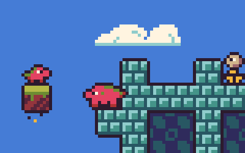

# js13k-2023-harold-is-heavy

> My 2023 entry for the js13kgames competition, Harold is Heavy.

## PLAY THE GAME!

 - Play the version submitted to game jam at: https://js13kgames.com/entries/harold-is-heavy
 - The most recent version is available at: https://harold-is-heavy.7tonshark.com
 - Also check out my [blog post](https://7tonshark.com/posts/making-of-js13k-2023-harold-is-heavy/) on the making of Harold is Heavy!

(See changelog below for more information on changes, bug fixes, etc.)

## INSTRUCTIONS

It's the 13th century in the Floating Isles of Isildor, and the king is rounding up baby dragonkin everywhere. All but the improbably heavy Harold (because nobody could figure out how to move him).

Throw Harold's weight around in this silly platformer and rescue your friends from the king's ugly, boring crates! Arrow keys or WASD to move, spacebar to jump.

## BUILD

To build the game for yourself:

 1. Clone the repository
 2. `npm install`
 3. `gulp build` (or just `gulp` to enter watch mode)

A normal build doesn't run the full terser / roadroller / zipping steps; for that, run `gulp build --dist`.

## TOOLS

 - Levels are built using [Tiled](https://www.mapeditor.org/). The level structure is flattened/minimized and inserted into the LevelData during the gulp build.
 - Art created using [Aseprite](https://www.aseprite.org/). All aseprite files in the assets folder is automatically smashed into a spritesheet during the build.
 - Sound effects created using [ZZFX](https://killedbyapixel.github.io/ZzFX/).
 - Music composed in [Sound Box](https://sb.bitsnbites.eu/).

## TIPS AND TRICKS

  
Click me (contains light spoilers)

  - As the end-game victory screen suggests, you can jump to any level with number keys 1-4.
  - You can also jump to the victory screen by pressing 5.
  - The victory screen will replay your last COMPLETED level, so you can trick it into playing a replay of another level by playing a level and then pressing 5 after completing it.
  - Your speedrun score is based on the total seconds spent in each level. Your time is tracked separately for each level and is updated when you complete a level.
  - Note that enemies left alive have a 5 second penalty, so for maximum points, crush every enemy and rescue your friends as quickly as possible.

## CHANGELOG

#### [v1.3.0](https://github.com/elliot-nelson/js13k-2023-harold-is-heavy/releases/tag/v1.3.0) (2023-10-10)

 - Fixed an issue where the frame rate was actually somewhat variable based on browser and operating system. Although the _intent_ was 60 FPS, in actuality it ranged between 40 and 50 FPS. The new, fixed frame rate is 42 FPS.

#### [v1.2.0](https://github.com/elliot-nelson/js13k-2023-harold-is-heavy/releases/tag/v1.2.0) (2023-10-01)

 - Bugfix: victory screen text was not aligned properly.
 - Interpolate camera movement so it is less shaky when following Harold.

#### [v1.1.0](https://github.com/elliot-nelson/js13k-2023-harold-is-heavy/releases/tag/v1.1.0) (2023-09-24)

 - Replace tiny 3x5 font with a more relaxed 4x5/5x5 font.

#### [v1.0.1](https://github.com/elliot-nelson/js13k-2023-harold-is-heavy/releases/tag/v1.0.1) (2023-09-21)

 - Bugfix: speedrun score calculation was incorrect.
 - Miscellaneous code cleanup and refactoring.

#### [v1.0.0](https://github.com/elliot-nelson/js13k-2023-harold-is-heavy/releases/tag/v1.0.0) (2023-09-12)

 - Submitted to game jam.
